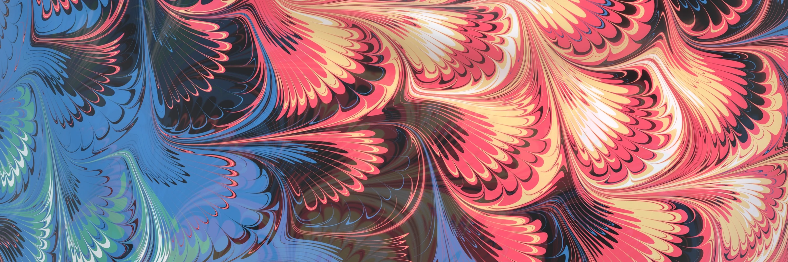

# Replicability

Awarded the [Graphics Replicability Stamp](https://www.replicabilitystamp.org#https-github-com-dougjam-mixwell-2026) by the GRSI on 2026-08-28.

Notes for reproducing representative results from:

> **Mixwell: Sharp 2D Fluid Brushes for Progressive Physics-Based Mixing**
> Doug L. James and Ethan James
> ACM Transactions on Graphics 45(4), Article 79 (SIGGRAPH 2026)
> DOI: [10.1145/3811312](https://dl.acm.org/doi/10.1145/3811312)
> Project page: <https://dougjam.github.io/mixwell-2026/>

**Target platforms:** Windows, Linux, and macOS. The primary replication path
runs in any WebGL2-capable browser with no installation. The Houdini path uses
the free non-commercial Houdini Apprentice edition.

**License:** all released code is MIT licensed (see [LICENSE](LICENSE)), with a
two-line SPDX header in every source file.

This repository also hosts the paper's project website; the released code lives
under [`public/code/`](public/code/) and is served from the project page's
[Code & Libraries](https://dougjam.github.io/mixwell-2026/code) section, where
every file can also be read with syntax highlighting.

---

## 1. Quick path: browser demonstrations (no installation)

The core methods of the paper are demonstrated as public Shadertoy programs.
Each runs in seconds in any WebGL2 browser on any OS; the GLSL source is
visible and editable on each page. Together they cover most of the paper's
core technical content:

| Shadertoy | Reproduces |
| --- | --- |
| [Marbling Patterns](https://www.shadertoy.com/view/sfGGzV) | Figs. 23 and 25-27. Progressive rendering of eight marbling patterns from the paper (keys 1-8: noisy Nonpareil, diagonal base patterns, Birdwing triwave combs, Bouquet/Peacock, FrogFoot, Thistle, Tornado, SuperTornado). Mouse x scrubs through the marbling passes; the bottom half visualizes the Reverse-Drift Function (RDF). Rendering is truly progressive: 1 sample per pixel while interacting, converging one sample per frame at rest. These patterns are also reproducible with the `Patterns` network in the Houdini project (Sec. 3). |
| [Mixwell Brush Demo](https://www.shadertoy.com/view/WcdXDn) | Figs. 7, 11, and 21. The Mixwell brush applied as a live marbling stroke (the "brushbird" example). |
| [Brush vs Newton Solver](https://www.shadertoy.com/view/NfK3RK) | One brush stroke (`rdSegment`) evaluated two ways on identical input: the time-stepped Mixwell Brush with adaptive-midpoint integration (Sec. 5.6) versus the Newton-based time-inversion advection solver. The `P` toggle disables the singularity patch, reproducing the axis-singularity artifacts of supplemental Figs. 3 and 4. |
| [Maxwell Flow Time](https://www.shadertoy.com/view/XXdfz4) | Fig. 2. Maxwell's flow-time integral t(&sigma;,&eta;) for steady flow past a cylinder, with streamlines. |
| [Carlson and Elliptic Functions](https://www.shadertoy.com/view/XXtBD8) | Supplemental document, Appendix B and Fig. 10: GLSL evaluation of Carlson's R_F and R_D integrals and the incomplete elliptic integrals F and E built from them, over the full parameter range. |

The [project page's shader gallery](https://dougjam.github.io/mixwell-2026/demos/shaders)
lists these demos with thumbnails, along with additional talk-figure demos.

## 2. Shader libraries (the released implementations)

The Mixwell brushes and Reverse-Drift Functions are released in four shading
languages under [`public/code/`](public/code/):

| Path | Language | Contents |
| --- | --- | --- |
| `public/code/glsl/` | GLSL | `Mixwell.glsl` (full library: brushes, particle drift, RDFs, Newton solver), `MixwellBrush.glsl` (brush-only lite). |
| `public/code/hlsl/` | HLSL | `Mixwell.hlsl` (full library), `MixwellBrush.hlsl` (brush-only lite). |
| `public/code/opencl/` | OpenCL | `Mixwell.cl` (kernel library for Houdini Copernicus), plus the Houdini project below. |
| `public/code/osl/` | OSL | Six Redshift OSL shaders (UV-to-position, Gel-Git, Nonpareil, TriWave RDF passes, paint color maps, UV test), plus the teaser scene below. |

The Shadertoy demos above are built on the same GLSL library, so running them
exercises this code directly.

## 3. Houdini path: Copernicus figure networks (free Apprentice edition)

`public/code/opencl/hmarbleWeb.hipnc` is a Houdini project in the
**non-commercial `.hipnc` format**, openable in the free
[Houdini Apprentice](https://www.sidefx.com/products/houdini-apprentice/)
edition on Windows, Linux, or macOS. Each example is a Copernicus (COP)
network with the OpenCL node running the `Mixwell.cl` kernels inside.

It contains worked examples for several paper figures
([network overview image](https://dougjam.github.io/mixwell-2026/images/houdini/hmarble-nodes.webp)):

| Network | Reproduces |
| --- | --- |
| `fig_nonpareilNoisy` | Fig. 23 |
| `fig_GelGit` | Fig. 24 |
| `fig_Maxwell` | Simulation of Maxwell's classic image (Sec. 2, inset); used in the talk |
| `fig_triwaves` | Fig. 14 |
| `fig_rdSegment` | Fig. 12 |
| `Patterns` | Figs. 25-28 |
| `SupplementalTeaser-BirdwingZoom` | Supplemental document, Fig. 1 (Brush or Newton solver supported) |

Open the project, dive into a COP network, and view the output to regenerate
the corresponding image.

## 4. Redshift OSL materials (renders out of the box; commercial renderer)

The OSL shaders in `public/code/osl/` and the scene
`public/code/osl/scarvesWeb.hipnc` are the materials behind the paper's teaser
(Fig. 1), rendered with Houdini + Redshift. The scene includes a **test-quads
setup** (three flat quads carrying the Bouquet, GelgitNonpareil, and Feather
materials), so it renders out of the box with Houdini + Redshift and no
additional assets.

These materials remain **outside the formal replication claim** only because
Redshift is a commercial renderer with no free non-commercial tier. Two notes
on scope:

- The full teaser composition (Fig. 1) additionally uses the artist's scarf
  geometry, which is licensed and cannot be redistributed (available separately
  on TurboSquid; see the scene notes). The test quads reproduce the teaser's
  three materials without it.
- The complete shader source and Redshift Material Builder graphs are included
  and documented on the
  [Code & Libraries](https://dougjam.github.io/mixwell-2026/code) page.

## 5. Scope and exclusions

- The interactive WebGPU application shown on the project page is a compiled
  demo whose C++ source is not part of this release; the shader libraries it
  is built on are released here.
- The teaser's materials render out of the box from the included scene (Sec. 4),
  but the full Fig. 1 composition requires the separately licensed artist
  geometry, and Redshift is commercial.
- Not every figure in the paper is covered; the artifacts above reproduce a
  representative set of results and nearly all of the paper's core technical
  content (brushes, drift, RDF passes, pattern composition, the Newton
  solver comparison, and the special-function evaluation).

## 6. Interactive demonstrations

The Shadertoy programs are interactive (mouse scrubbing, keyboard toggles);
their controls are documented in each program's header comment. The paper
video, linked from the [project page](https://dougjam.github.io/mixwell-2026/),
documents the intended behavior of the interactive demonstrations.
